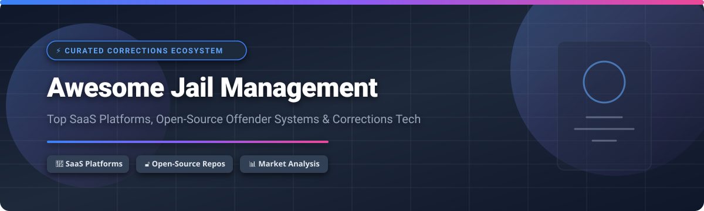

# Awesome Jail Management Software & Systems 🏢🔒

  

  
  
  
  
  

> 💡 A curated list of enterprise SaaS products, correctional technology platforms, and open-source jail management systems (JMS). Focused on intake/booking 📋, inmate tracking 🏷️, housing 🛌, classification ⚖️, visitation 🤝, inmate communications 📞, commissary 🛒, and corrections facility operations.

**📅 Last updated: September 2026**

---

## 📑 Table of Contents

- [📊 Market Dynamics & Overview](#-market-dynamics--overview)
- [💻 SaaS & Commercial Platforms](#-saas--commercial-platforms)
- [🔓 Open-Source GitHub Projects](#-open-source-github-projects)
- [⚙️ Key Features of Jail Management Systems](#%EF%B8%8F-key-features-of-jail-management-systems)
- [🤝 How to Contribute](#-how-to-contribute)
- [💖 Support & Sponsorship](#-support--sponsorship)
- [📈 Star History](#-star-history)
- [⚠️ Disclaimer](#%EF%B8%8F-disclaimer)

---

## 📊 Market Dynamics & Overview

The global Jail Management Software (JMS) market is estimated at **$580 Million to $6.37 Billion** (depending on inclusion of broader prison IT and offender telecommunications), with projected growth reaching **$1.8 Billion – $10 Billion+ by 2034** (CAGR ~12%). 

The sector structure is **moderately concentrated at the enterprise level with fragmented specialized niches**. A few dominant ERP and corrections telecommunications giants (such as Tyler Technologies, ViaPath/GTL, and CentralSquare) control core county and state agency software contracts, while specialized niche providers (e.g. RFID tracking, inmate messaging, trust accounting) compete across mid-sized and local detention facilities.

---

## 💻 SaaS & Commercial Platforms

| Platform 🌐 | Company Size 🏢 (Est. Revenue / Valuation) | Starting Pricing Tier 💵 | Free Tier / Trial Limits ⏳ | Key Capabilities & Description 📝 |
| :--- | :--- | :--- | :--- | :--- |
| **[Tyler Jail Manager](https://www.tylertech.com/)** | **$2.33B Revenue** ($24.9B Market Cap) | Enterprise Quote (approx. $15,000 upfront base license) | Demo environment upon request; No public free trial | Comprehensive public-safety and corrections suite supporting booking, custody classification, and court records integration. |
| **[GTL Offender360 / ViaPath](https://www.gtl.net/)** | **~$500M Revenue** ($5B+ Historical Capitalization) | Enterprise Contract (custom agency tier based on inmate capacity) | Demo sandbox for agency RFPs; No public free trial | End-to-end offender management, tablet services, inmate calling, and intelligence analytics for state/county facilities. |
| **[CentralSquare Jail Management](https://www.centralsquare.com/)** | **~$320M Revenue** ($1B+ Valuation Trajectory) | Enterprise Tier (starts ~$10,000/yr for small municipal jails) | 30-Day guided software demo; No public free trial | Integrated jail booking, housing roster management, incident logging, and law enforcement CAD/RMS synchronization. |
| **[TurnKey Corrections](https://www.turnkeycorrections.com/)** | **~$30M Revenue** | Facility Contract (variable kiosk fee + facility commission model) | Customized facility pilot program; No public free trial | All-in-one corrections technology providing inmate kiosks, commissary processing, video visitation, and trust fund accounting. |
| **[Corrisoft](https://www.corrisoft.com/)** | **~$18M Revenue** | Commercial Plan (starts ~$3.50/day per offender tracked) | 14-Day agency trial unit pilot; No public free trial | Smartphone-based offender supervision (AIR platform), location tracking, and community corrections monitoring. |
| **[SmartJAIL Mail](https://www.smartjailmail.com/)** | **~$15M Revenue** | Pay-as-you-go per message ($0.50/message; facility rate plans available) | 1 Free test message per newly created account | Postal mail elimination, electronic two-way inmate messaging, and digital photo/document delivery. |
| **[VendEngine](https://www.vendengine.com/)** | **~$12M Revenue** | Facility SaaS Fee (custom percentage or flat software agreement) | Interactive sales demo session; No public free trial | Inmate financial platform, trust fund management, web deposit portals, and commissary management software. |
| **[Encartele](https://www.encartele.net/)** | **~$10M Revenue** | Commercial Contract (custom rates based on facility phone/video lines) | On-site hardware pilot for qualifying facilities; No public free trial | Inmate telecommunication platforms, inmate phone monitoring, video visitation units, and digital communication kiosks. |
| **[Guardian RFID](https://guardianrfid.com/)** | **~$8M Revenue** | System Plan (starts ~$900 implementation + annual System Renewal Fee) | On-demand live demo & ROI audit; No public free trial | Verifiable cell checks, inmate tracking, RFID wristbands, and real-time headcount accountability software. |
| **[Tribridge Jail / Justice](https://www.tribridge.com/)** | **~$5M Segment Revenue** | Custom Enterprise License (Microsoft Dynamics base) | Demo walkthrough for government IT teams; No public free trial | Microsoft Dynamics-based public sector justice platform for offender tracking and judicial workflows. |

---

## 🔓 Open-Source GitHub Projects

Below are open-source repositories, libraries, datasets, and prototype applications related to prison education, facility data analysis, and offender management.

| Repository 📦 | Stars ⭐ | Description & Link 📌 |
| :--- | :--- | :--- |
| **[vera-institute/incarceration-trends](https://github.com/vera-institute/incarceration-trends)** |  | Comprehensive US dataset and analysis tools on jail and prison populations across local jurisdictions. |
| **[uclalawcovid19behindbars/facility_data](https://github.com/uclalawcovid19behindbars/facility_data)** |  | Detailed spatial and structural repository mapping facilities, capacity, and operational metrics across US detention centers. |
| **[ministryofjustice/digital-prison-services](https://github.com/ministryofjustice/digital-prison-services)** |  | UK Ministry of Justice core front-end service for digital prison operations, prisoner lookup, and activity scheduling. |
| **[ministryofjustice/offender-management-allocation-manager](https://github.com/ministryofjustice/offender-management-allocation-manager)** |  | Service allocating Prison Offender Managers (POMs) to custody cases for rehabilitation and case planning. |
| **[danilofreire/prisonbrief](https://github.com/danilofreire/prisonbrief)** |  | R library for parsing and analyzing global incarceration metrics from the World Prison Brief index. |
| **[operepo/ope-server](https://github.com/operepo)** |  | Open Prison Education (OPE) offline-capable container server delivering offline Canvas LMS and educational materials inside correctional facilities. |
| **[worlds-biggest-software-project/379-corrections-offender-management](https://github.com/worlds-biggest-software-project/379-corrections-offender-management)** |  | AI-native open-source prototype covering booking intake, inmate classification, program tracking, and release planning. |
| **[Viththiyakaran/prison-management-system](https://github.com/Viththiyakaran/prison-management-system)** |  | PHP and MySQL prototype system managing prisoner profiles, cell allocations, visitor logs, and guard schedules. |
| **[j-a-y-e-s-h/jailmaster](https://github.com/j-a-y-e-s-h/jailmaster)** |  | Web-based jail administration tool for recording inmate intake, property inventory, and bail tracking. |
| **[kaiimran/alcatraz-prison-management-system](https://github.com/kaiimran/alcatraz-prison-management-system)** |  | Lightweight C++ terminal application for custody records, officer duty rosters, and security classification. |

---

## ⚙️ Key Features of Jail Management Systems

A modern Jail Management System (JMS) typically integrates the following modules:

1. 📋 **Intake & Booking**: Capturing biometrics, mugshots, personal property logging, and CJIS background checks.
2. ⚖️ **Inmate Classification & Housing**: Automated risk scoring, gang conflict mitigation, and cell block assignment.
3. 🏷️ **RFID & Biometric Tracking**: Verifiable cell checks, inmate movement logging, and digital headcounts.
4. 🛒 **Trust Fund & Commissary**: Inmate accounting, web deposits, debit balances, and commissary point-of-sale (POS).
5. 📞 **Communications & Mail**: Electronic messaging, video visitation, call monitoring, and postal scan automation.

---

## 🤝 How to Contribute

1. Fork this repository. 🍴
2. Add or update entries in `README.md` maintaining table formatting. ✍️
3. Ensure entries include accurate pricing, company scale, or GitHub Stars_Badges. ⭐
4. Open a Pull Request with a brief explanation of changes. 🚀

---

## 💖 Support & Sponsorship

Thank you for visiting and supporting this curated resource! If you find this list valuable, please consider giving it a ⭐ **Star**, **Forking** it, or **Sharing** it with public safety and corrections technology professionals.

If you'd like to support ongoing open-source research and maintenance, consider buying a coffee via the Sponsor dashboard:

---

## 📈 Star History

---

## ⚠️ Disclaimer

This list is community-curated for informational purposes only. Jail management systems store CJIS-sensitive and legal records. Open-source repositories listed here are intended for research, education, or baseline reference and should be thoroughly audited before any operational deployment.
